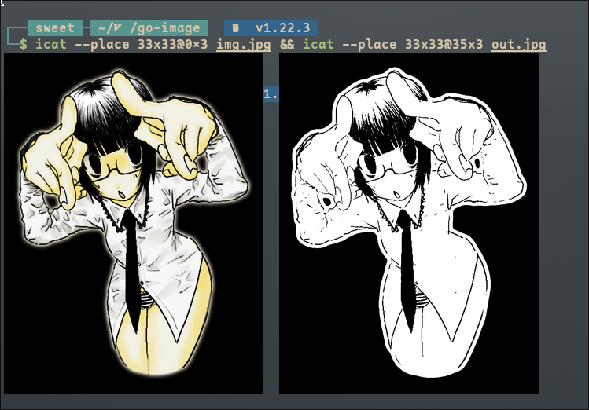
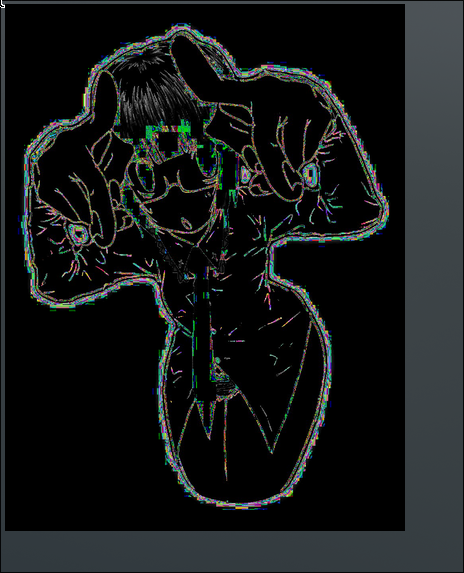

+++
title = 'glitch art and image processing with golang'
author = 'sweetbbak'
date = 2024-07-04T11:38:00-08:00
draft = false
+++

Glitch art and color image processing in Go

<!--more-->

# Building a glitch art wallpaper utility

It is truly astounding how often my journey in programming shatters my world view about certain
concepts. For a lot of things in life we may not really ask "why" or "how" something works,
we just accept it as normal while paying no attention to the amount of work and innovation that built the foundation
for modern technology and standards. Image encoding formats are one of these things.

Is an image just a multi-dimensional array of pixels?

Steps:

1. We will create a contrast mask for our image
2. Use that contrast mask as a guide for pixel sorting by HUE
3. Apply a tonemap
4. Create a Kuwahara filter
5. sharpness filter
6. Floyd-Steinberg Dither
7. Zoom in to the image
8. Slight Chromatic aberration
9. apply a 3D LUT (color lookup table) to the image
10. randomly offset our pixel sorting to create animation frames and create a gif

I will be using `Golang` to do this, as it is easily readable by anyone, has an amazing and fast native image processing library in the stdlib,
and it is extremely easy and fast to iterate off of. I spent most of my time researching and hashing out concepts, and trying things out very quickly to see if
my ideas would work and not fighting the language.

for example opening an image in `Golang`:

```go
import (
    "image"
    "os"
)

func openImage(imgpath string) (image.Image, error) {
	file, err := os.Open(imgpath)
	if err != nil {
		return nil, err
	}
	defer file.Close()

	img, _, err := image.Decode(file)
	if err != nil {
		return nil, err
	}

	return img, nil
}

```

A little side-note about error handling in Go... People unfamiliar with the language, or people who are used to interpreted languages, often have trouble with Go's
error handling. It's nowhere near as bad as people make it out to be, especially if you follow some basic rules.

- handle your errors
  for `os.Open` the decision is obvious! If we can't open the image, we can't operate on the image. Bubble up the error, log it out, and exit. Simple as that.
  for `image.Decode` we can read the hover description OR use goto definition to easily see that this function returns a single error for decoding images, `images.ErrFormat` defined as:

```go
var ErrFormat = errors.New("image: unknown format")
```

This example is equally as simple, if the image is of an unknown format, this error will be returned. Under no circumstances should we be continuing program execution if we
get an error here. Log it out to stderr and exit.

We can even add some extra context if we want to, knowing that this error will be bubbled up to the user.

```go
img, _, err := image.Decode(file)
if err != nil {
	return nil, fmt.Errorf("%w - known image formats are jpeg and png", err) // we return nil because image.Image is an interface
}

```

which would return:
`2024/07/04 12:19:15 image: unknown format - known image formats are jpeg and png`

I also find the following format of writing programs extremely helpful (outside of writing libraries)

```go

func writeImageToFile(img image.Image) error {
    // ...
}

func ContrastMask(img image.Image) error {
    // ...
}

func Imager(path string) (image.Image, error ) {
	// init image
	img, err := openImage(path)
	if err != nil {
		return err
	}

	// image pipeline
	finalImage, err := ContrastMask(img)
    if err != nil {
        return fmt.Errorf("failed to process image: %w", err)
    }

	// finally save image
    if err := writeImageToFile(finalImage); err != nil {
        return err
    }

	return nil
}

func main() {
	args := os.Args
	if len(args) < 2 {
		fmt.Print("usage: pixi \n")
		os.Exit(0) // this is technically wrong by GNU/Unix standards, you should exit with a useful exit code like 1, to indicate a generic failure but my OCD won't let me U_U
	}

	if err := Imager(args[1]); err != nil {
		log.Fatal(err)
	}
}
```

why is this good?

- This keeps things extremlely simple, readable and modular. In main we handle argument parsing (which can be more complex) and create a central exit point for frames to return to.

- In the `Imager` function we essentially have the actual `main` function. This func handles delegating tasks, handling errors and finalizing the execution OR returning the error to the user in a useful format.

- We can easily plug in new functions that in this context would amount to different image processing pipelines. This would also allow us enough flexibility to decide our image processing pipeline at runtime via flag parsing

You can imagine that it would be easy to take the image returned from the contrast mask
function and plug it into another function that takes an `image.Image` to apply Gaussian blur, dithering, etc...

This also means we avoid redundant file IO and all of our functions can
simply follow the format of returning an `error` or an `image.Image` there is a nice flow to this.

Then on top of that we can break down our image processing pipelines into separate files to handle singular operations.

This format makes reading the code very simple and organized. It also avoids some very annoying issues around errors. This kind of forces you to do things
correctly. Each of our functions has a definite goal and scope.

## Creating a Contrast Mask

Doing some research on creating a contrast mask brought me to this post [formula-to-determine-perceived-brightness-of-rgb-color](https://stackoverflow.com/questions/596216/formula-to-determine-perceived-brightness-of-rgb-color)

The general idea would be to:

- First convert gamma encoded RGB image values to linear luminance ( Y ).
- linearize each RGB value to linear RGB
- apply the weighting coefficients to each R, G, B value.
- sum the results to get Y.
- Then convert Y to non-linear perceived lightness (L\*).

This is what I landed on for a function to calculate the luminance of an RGBA pixel:

```go
// https://stackoverflow.com/questions/596216/formula-to-determine-perceived-brightness-of-rgb-color
// sRGB luminance(Y) values
const rY float64 = 0.21258623078559555160
const gY float64 = 0.71517030370341084990
const bY float64 = 0.07220049864333622685

// inverse gamma - reverses RGB gamma
func inv_gam_sRGB(ic int) float64 {
	c := float64(ic / 255.0)
	if c <= 0.0404482362771076 {
		return c / 12.92
	} else {
		return math.Pow(((c + 0.055) / (1.055)), 2.4)
	}
}

func gam_sRGB(v float64) float64 {
	if v <= 0.0031308 {
		v *= 12.92
	} else {
		v = 1.055*math.Pow(v, 1.0/2.4) - 0.055
	}

	// This is correct in C++. Other languages may not require +0.5
	// return v*255 + 0.5
	return v * 255
}

func LABF(Y float64) float64 {
	if Y >= 8.85645167903563082e-3 {
		return math.Pow(Y, 0.333333333)
	} else {
		return (841.0/108.0)*(Y) + (4.0 / 29.0)
	}
}

// why 3 you ask? Well, lets just say this isn't my first attempt...
func calculateLuminance3(r, g, b int) float64 {
	luma := gam_sRGB(float64((rY * inv_gam_sRGB(r)) + (gY * inv_gam_sRGB(g)) + (bY * inv_gam_sRGB(b))))
	return LABF(luma)
}
```

I then create an arbitrary min and max threshold, iterate over each pixel in the image and then flip that pixel to either black or white depending of if they are above or below our threshold range.

Damnnnn that looks good! I am proud of myself :3 I may not perfectly understand how this works but I do think there is some merit in taking an abstract concept and translating that into code


in my attempt to translate this snippet for Reinhards formula for tone mapping from C++ to Go...

```c
float luminance(vec3 v)
{
    return dot(v, vec3(0.2126f, 0.7152f, 0.0722f));
}

vec3 change_luminance(vec3 c_in, float l_out)
{
    float l_in = luminance(c_in);
    return c_in * (l_out / l_in);
}
```

```go
func changeLuma(r, g, b, a uint32, l_out float64) color.RGBA {
	l_in := calculateLuminance3(int(r), int(g), int(b))
	fmt.Println(l_in)

	if l_in > 0 {
		rr := int(r) * int(l_out/l_in)
		gg := int(g) * int(l_out/l_in)
		bb := int(b) * int(l_out/l_in)

		return color.RGBA{uint8(rr), uint8(gg), uint8(bb), uint8(a)}
	} else {
		return color.RGBA{uint8(r), uint8(g), uint8(b), uint8(a)}
	}

}

// C_out = C_in * ( luminance_in / luminance_out )
func tonemap(img image.Image) image.Image {
	mask := image.NewRGBA(img.Bounds())

	for x := 0; x < img.Bounds().Dx(); x++ {
		for y := 0; y < img.Bounds().Dy(); y++ {
			r, g, b, a := img.At(x, y).RGBA()
			clr := changeLuma(r, g, b, a, 33.33)
			mask.Set(x, y, clr)
		}
	}
	return mask
}
```

idk how this happened but it looks cool lmao



## 3D Cube LUT

How does a 3D LUT work? Each numeric row has three entries, which represent R, G, and B output values, often 0.0 to 1.0 (but could be higher or negative for some cases).
Each row represents a position in the 64x64x64 input cube. The input R,G,B value (sometimes after running through a lg2 "shaper" if it is linear) gets multiplied by 63
(in the case of a 64x64x64 cube) and rounded to the nearest integer.

Then the row number of r*64*64 + g*64 + b. For example, input of rgb={0.1, 0.2, 0.3} becomes rgb_index={6.3, 12.6, 18.9} which become rgb_index_int={6, 13, 19}
which is row index 6*64*64 + 13*64 + 19 = 25427, if you are looking for the nearest element. It's actually more complex than that since tri-linear or tetrahedral
interpolation is used, which means 8 or 4 elements surrounding the 3D position are looked up and interpolated to create the output RGB value.
